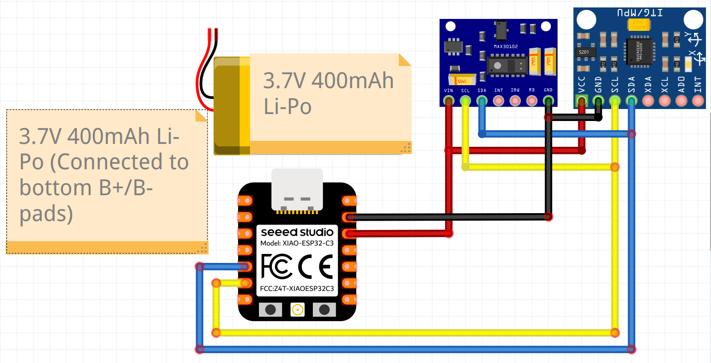

# Wearable Vital Signs Monitor  
  
A **wearable device prototype** for measuring vital signs and user activity, with planned mobile app integration.  
  
The device measures:  
  
- heart rate / HR,  
- blood oxygen saturation / SpO₂,  
- planned: steps, signal quality, and motion artefacts.  
  
The project runs on a **Seeed XIAO ESP32-C3**, uses **FreeRTOS**, **BLE** communication, and custom drivers and signal-processing algorithms.  
  
> The project is currently under development and will be updated regularly.  
  
---  
  
## Demo  
<p align="center">
  <video src="https://github.com/user-attachments/assets/80e574f7-a5c9-4611-a4b2-5a76588d8c59"></video>
</p>
    
---  
  
## Implemented  
  
- data reading from **MAX30102** and **MPU6050**,  
- custom sensor drivers for **MAX30102** and **MPU6050**,  
- task handling with **FreeRTOS**,  
- data buffering,  
- PPG signal filtering,  
- heart rate calculation using:  
	- peak detection,  
	- autocorrelation,  
- SpO₂ calculation using:  
	- Ratio of Ratios,  
- simple **confidence score** based on result fusion,  
- basic **BLE server** based on NimBLE,  
- stable HR and SpO₂ readings at rest.  
  
---  
  
## In Progress  
  
- motion artefact detection,  
- motion noise reduction,  
- NLMS filter testing,  
- mobile app for data preview,  
- confidence score improvement,  
- step counter,  
- prototype optimization for longer battery life.  
  
---  
  
## Components Used  
  
- Seeed XIAO ESP32-C3  
- MAX30102  
- MPU6050  
- PlatformIO  
- Arduino Framework  
- FreeRTOS  
- NimBLE  
  
---  
  
## Circuit Diagram  
  
  
  
---

##  Wiring Table

Both the heart rate sensor (MAX30102) and the IMU (MPU6050) share the same I2C bus and 3.3V power supply from the microcontroller.

| Function / Signal | XIAO ESP32-C3 | MAX30102 | MPU6050 | Li-Po Battery (3.7V 400mAh) |
| :--- | :--- | :--- | :--- | :--- |
| **Power (3.3V)** | `3V3` | `VCC` | `VCC` | - |
| **Ground (GND)** | `GND` | `GND` | `GND` | - |
| **I2C SDA** | `D4` | `SDA` | `SDA` | - |
| **I2C SCL** | `D5` | `SCL` | `SCL` | - |
| **Battery (+)** | `B+` *(bottom pad)* | - | - | Red wire `+` |
| **Battery (-)** | `B-` *(bottom pad)* | - | - | Black wire `-` |

---

## Signal Processing Pipeline

The firmware processes PPG data from the MAX30102 sensor using the following pipeline:

```
Raw RED / IR samples
        ↓
Median filtering
        ↓
High-pass filtering
        ↓
Low-pass filtering
        ↓
AC/DC component extraction
        ↓
Peak detection + autocorrelation
        ↓
Heart rate estimation
        ↓
Ratio of Ratios calculation
        ↓
SpO₂ lookup table
        ↓
Result validation and smoothing
```

---

## Project structure

```txt
include/
├── config.h
└── SystemContext.h

lib/
├── algorithms/
│   ├── PpgProcessor.cpp
│   └── algorithm_NLMS.cpp
├── ble_manager/
│   └── BLE.cpp
├── max30102/
│   └── max30102_driver.cpp
└── mpu6050/
    └── mpu6050_driver.cpp

src/
├── main.cpp
├── tasks.cpp
└── tasks.h
```

---
## How to Run

1.  Clone the repository:

```
https://github.com/Marcin225/Wearable-firmware
```

2.  Open the project in **VS Code + PlatformIO**.
3.  Connect the sensors to the I2C bus.
4.  Build the project:

```
pio run
```

5.  Upload the firmware:

```
pio run --target upload
```

6.  Open the serial monitor:

```
pio device monitor
```
