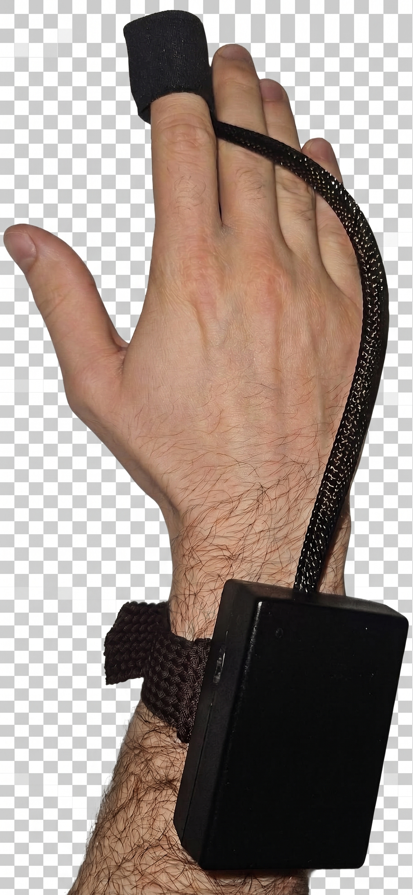
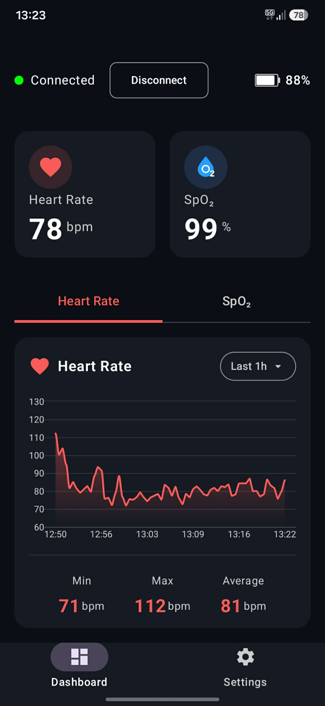
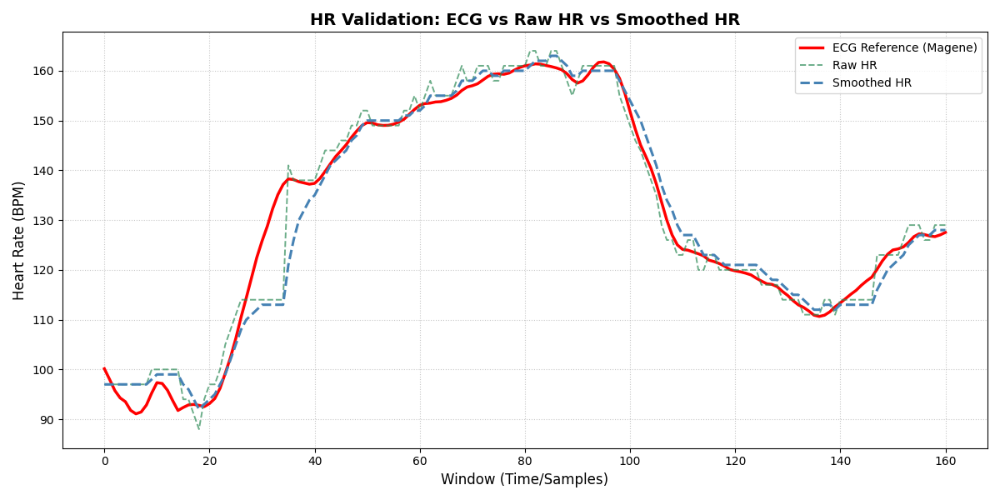
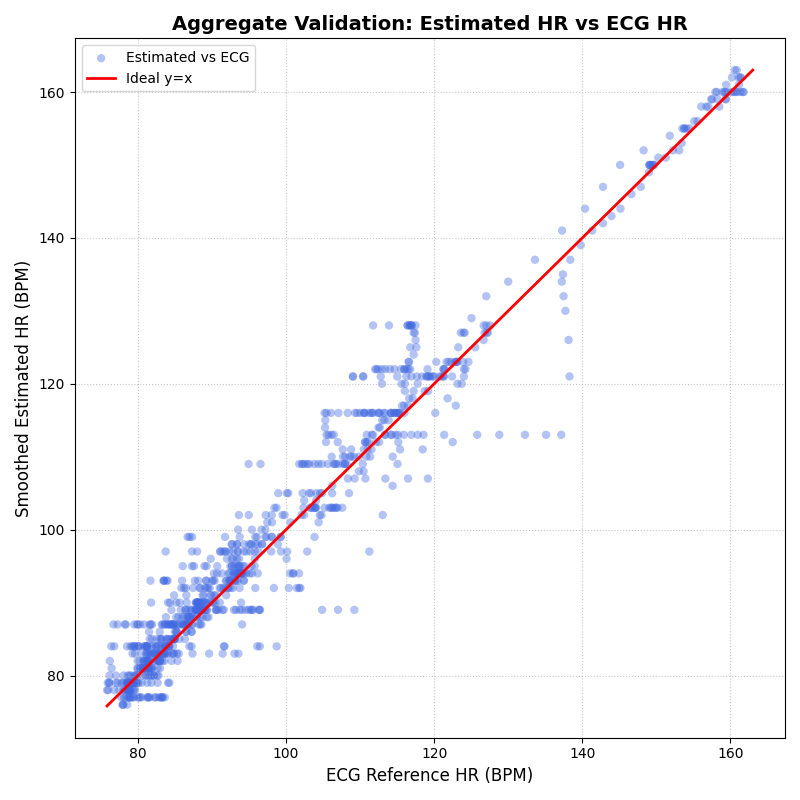

# SmartBand

SmartBand is a wearable device based on the ESP32-C3 for real-time heart-rate and SpO2 estimation using optical PPG signals.

The system combines PPG measurements with accelerometer data for motion-aware heart-rate estimation and includes BLE communication, battery monitoring and power-efficient operation.

## Features

- custom drivers for the MAX30102, MPU6050-compatible IMU and MAX17048 sensors
- custom heart-rate and SpO2 estimation algorithms implemented using integer and fixed-point arithmetic
- accelerometer-based motion artifact analysis and motion-aware HR candidate scoring
- custom fixed-point FFT and signal-processing pipeline running directly on the ESP32-C3
- FreeRTOS-based separation of sensor acquisition and vital-sign calculation
- measurement reliability handling using HR signal-quality analysis and a dedicated state machine
- BLE transmission of heart rate, SpO2 and battery level
- battery state-of-charge monitoring using the MAX17048
- power-efficient operation using batched sensor acquisition, automatic light sleep during idle periods, deep sleep during inactivity and accelerometer-based motion wake-up

## Mobile Application

A companion mobile application receives measurement results from the device over Bluetooth Low Energy and displays heart rate, SpO2 and battery level.

Unreliable HR or SpO2 measurements are displayed as `--`.

[Mobile application repository](https://github.com/Marcin225/wearable-mobile-app)

## Validation Highlights

Heart-rate estimation was validated against an ECG chest strap using seven recordings covering rest, controlled arm movements, walking, jogging and irregular whole-body motion.

The algorithm maintained low HR estimation error across most tested conditions, including continuous movement.

All validation recordings were collected from a single participant.

| Dataset | Valid ratio [%] | MAE [BPM] | RMSE [BPM] | Within ±10% or 5 BPM [%] |
| :--- | ---: | ---: | ---: | ---: |
| Rest | 100.00 | 2.12 | 2.94 | 98.25 |
| Linear arm motion | 100.00 | 2.27 | 3.38 | 96.89 |
| Rotational motion | 78.12 | 2.03 | 3.30 | 92.00 |
| Marching in place | 39.38 | 5.43 | 6.82 | 90.48 |
| Brisk walk | 80.12 | 4.65 | 5.91 | 96.90 |
| Jogging | 100.00 | 2.60 | 4.55 | 96.27 |
| Random motion | 91.30 | 3.67 | 4.88 | 93.88 |

### Jogging

### Overall HR Agreement

[Detailed validation results](docs/validation/overview.md)

## Battery Life

Battery runtime is measured using the 3.7 V 400 mAh Li-Po battery during normal continuous operation without entering deep sleep.

**Measured runtime:** _to be added after battery-life testing._

## Documentation

Detailed documentation covering the complete hardware and firmware implementation is available in the [`docs/`](docs/) directory.

- [Architecture](docs/architecture/overview.md)
- [Hardware](docs/hardware/overview.md)
- [Signal Processing](docs/signal_processing/overview.md)
- [Testing](docs/testing/overview.md)
- [Validation](docs/validation/overview.md)
- [Development](docs/development/project_structure.md)

## License

This project is licensed under the MIT License.