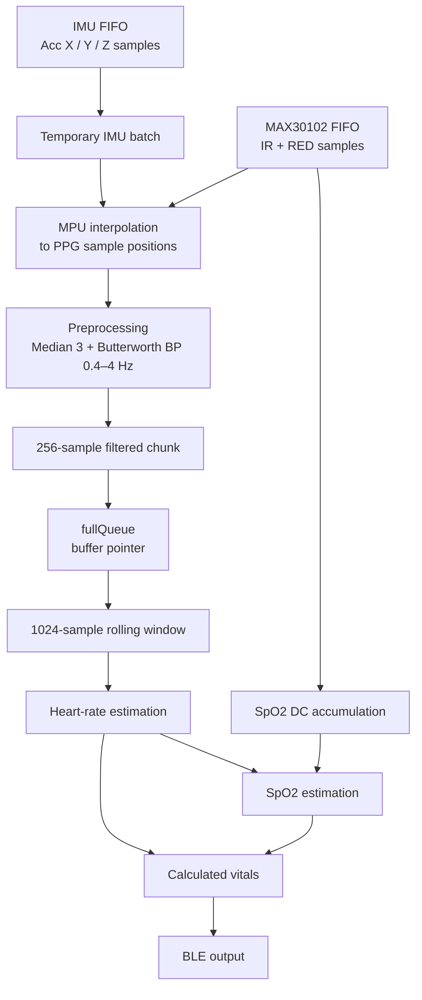

# Data Flow

Sensor data is acquired, filtered, buffered, and processed in two separate FreeRTOS tasks.

The MAX30102 defines the main acquisition timing. PPG samples are collected at **100 Hz** and read from the sensor FIFO in batches of approximately **28 samples every 280 ms**.

At the same time, accelerometer samples collected by the IMU are read and aligned with the PPG samples before preprocessing.

## Acquisition

The MAX30102 FIFO interrupt wakes `vCollectAndFilterDataTask` when a new batch of PPG samples is available.

During each acquisition cycle:

1. available accelerometer samples are read from the IMU and stored in a temporary batch buffer,
2. the available IR and RED samples are read from the MAX30102 FIFO,
3. for each PPG sample, the corresponding accelerometer values are obtained by interpolating the temporary IMU batch,
4. IR, RED, AccX, AccY and AccZ channels are preprocessed,
5. filtered samples are stored in the current measurement buffer.

The preprocessing stage consists of:

- a 3-sample median filter,
- a Butterworth band-pass filter with a passband of approximately **0.4–4 Hz**.

Raw IR and RED samples are also used to maintain the DC values required for SpO2 estimation.

## Measurement Chunks

Filtered data is collected into blocks of:

```text
CHUNK_SIZE = 256 samples
```

At a sampling rate of 100 Hz, one chunk represents: `256 / 100 = 2.56 seconds`

Each chunk contains:
- filtered IR,
- filtered RED,
- filtered AccX,
- filtered AccY,
- filtered AccZ,
- measurement session ID.

When a chunk is complete, a pointer to the filled measurement buffer is passed to `vCalculateVitalsTask` through a FreeRTOS queue. The collector then waits for another available buffer before continuing acquisition. After processing, the calculation task returns the used buffer so it can be filled again.

## Measurement Sessions

Each chunk contains a `sessionId` identifying the continuous measurement session in which it was collected.

The session ID changes when signal continuity is broken, for example after finger contact is lost. Before processing a chunk, the calculation task compares its session ID with the current measurement session. Chunks belonging to an older session are discarded.

This prevents samples collected before and after a measurement interruption from being combined into the same analysis window.

## Analysis Window

The calculation task combines incoming 256-sample chunks into a:

```text
BUFFER_SIZE = 1024 samples
```

analysis window. At 100 Hz, the full window represents: `1024 / 100 = 10.24 seconds`.

The initial result becomes available after four chunks have been collected: `4 × 256 = 1024 samples`.

After the initial window is filled, each new 256-sample chunk replaces the oldest 256 samples. The processing window therefore advances by 2.56 seconds while retaining the newest 768 samples from the previous calculation.

## Processing Flow



Heart-rate estimation is performed first because the selected HR frequency bin is also used during the SpO2 calculation.

## Update Rate

The main timing parameters are:

| Parameter | Value |
| :--- | :--- |
| Sampling rate | 100 Hz |
| MAX30102 batch | ~28 samples |
| Acquisition interval | ~280 ms |
| Chunk size | 256 samples |
| Analysis window | 1024 samples |
| Analysis window duration | 10.24 s |
| Result update interval | 2.56 s |

This buffering scheme allows sensor acquisition to continue independently while the calculation task performs the more computationally intensive signal-processing operations.