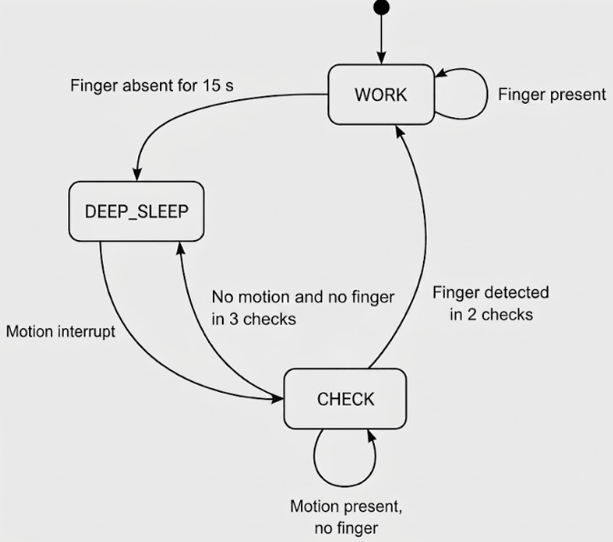

# Power Management

The firmware reduces power consumption by switching between normal measurement, periodic signal checking, and ESP32-C3 deep sleep.

The application uses two software operating modes, `WORK` and `CHECK`. Deep sleep is not represented as a `DeviceState` because the ESP32-C3 stops normal program execution while sleeping.

To reduce unnecessary processor activity and I2C communication, MAX30102 data is read from the FIFO in batches of approximately 28 samples every 280 ms instead of reading each sample individually.

The IMU is configured to use only the accelerometer, while the gyroscope remains disabled to reduce power consumption. Accelerometer data is sufficient for motion artifact detection and motion-based wake-up.

## WORK Mode

`WORK` is the normal measurement mode. The MAX30102 and IMU operate continuously and the system performs regular data acquisition.

Finger presence is determined from the raw IR signal using `FINGER_IR_THRESHOLD`.

When the IR level falls below the threshold for the first time:

- the current measurement session is invalidated,
- partially collected data is discarded,
- the finger removal timer is started.

If the finger returns before the timeout, normal measurement continues using a new measurement session.

If finger absence continues for **15 seconds**, the system prepares for deep sleep:

1. the MAX30102 enters shutdown mode,
2. the IMU is configured for motion detection,
3. the ESP32-C3 enters deep sleep.

## Deep Sleep

During deep sleep, the ESP32-C3 and MAX30102 remain inactive.

The IMU stays configured for low-power motion detection and its interrupt line is used as a wake-up source for the ESP32-C3.

When motion is detected, the ESP32-C3 wakes and starts in `CHECK` mode instead of immediately enabling continuous measurement.

## CHECK Mode

`CHECK` mode determines whether the detected motion was caused by the user preparing to take a measurement.

The MAX30102 is periodically activated to check for finger contact.

A valid PPG signal must be detected in **two consecutive checks** before the device returns to `WORK` mode. When this happens, the measurement state is reset and a new continuous measurement session begins.

If no finger is detected, accelerometer activity is evaluated.

- After **three consecutive low-motion checks**, the device returns to deep sleep.
- If motion continues without finger contact, the device remains in `CHECK` mode.
- After **five motion checks without a valid PPG signal**, the interval between optical checks is increased from **3 seconds to 5 seconds**.

Missing IMU samples are not treated as absence of motion.

Between consecutive checks, the MAX30102 is placed in shutdown mode and the IMU is temporarily put to sleep to reduce power consumption.

## State Flow

The measurement session is reset as soon as finger contact is lost rather than only when deep sleep is entered. This prevents samples collected before and after a signal interruption from being combined into the same processing window.