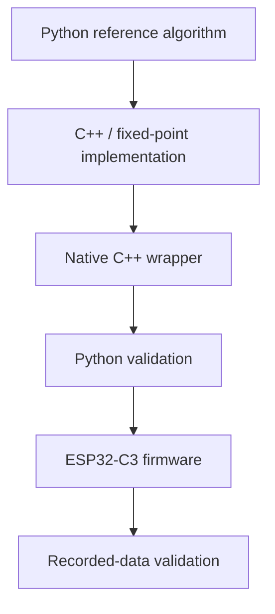

# Build and Development Environment

The project uses separate environments for embedded firmware development, native C++ testing and Python analysis.

This separation is necessary because not all test and analysis tools used by the project can be executed reliably through PlatformIO.

## Firmware

The embedded firmware is developed using **PlatformIO** with the Arduino framework for the **Seeed Studio XIAO ESP32-C3**.

PlatformIO is used for:

- compiling the ESP32-C3 firmware,
- uploading firmware to the device,
- serial communication and debugging.

The firmware can be built with:

```bash
pio run
```

and uploaded with:

```bash
pio run -t upload
```

## Native C++ Tests and Wrappers

C++ pipeline wrappers and Unity-based unit tests are executed in a separate native C++ environment rather than through the PlatformIO embedded build.

This allows the production signal-processing modules to be compiled and executed directly on the development computer using recorded CSV datasets.

The native tools include:

- preprocessing wrapper,
- RFFT wrapper,
- HR candidate wrapper,
- HR estimation wrapper,
- full vitals pipeline wrapper,
- Unity unit tests,
- parameter sweep tools.

The wrappers reuse the production signal-processing source files and configuration values used by the firmware.

## Python Environment

Python is used for:

- original reference implementations,
- C++ output validation,
- accuracy metric calculation,
- parameter analysis,
- generation of validation plots.

The main Python dependencies include:

- `numpy`
- `pandas`
- `scipy`
- `matplotlib`

## Development Workflow

The typical development workflow is:



Firmware compilation and hardware testing are therefore kept separate from native algorithm verification and offline analysis.

## PlatformIO Limitations

PlatformIO is used mainly for building and uploading the embedded firmware.

During development, several issues were encountered with native testing and debugging despite trying multiple PlatformIO configurations.

The main problems included:

- conflicts related to the Unity test framework,
- differences in dependency resolution between `pio run` and `pio test`,
- native test builds attempting to compile hardware-dependent libraries that were not required by the tested code,
- problems with detecting or using the system `gcc/g++` toolchain,
- graphical debugging through PlatformIO not working correctly even though command-line debugging with the same target worked.

The same C++ tests and wrappers worked correctly when compiled and executed in a separate native development environment.

For this reason, PlatformIO is used primarily for firmware development, while native tests, wrappers and selected debugging tasks are performed using separate development tools.