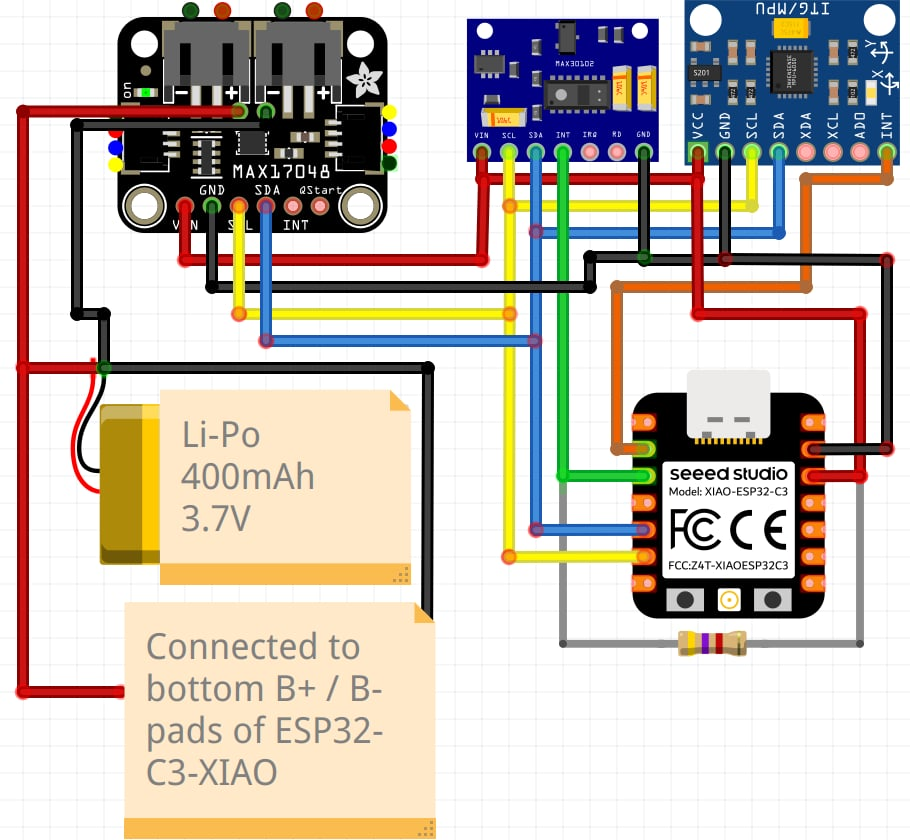

# Hardware Connections

The Seeed Studio XIAO ESP32-C3 communicates with the MAX30102, MPU6050-compatible IMU and MAX17048 through a shared I2C bus.

The MAX30102 and IMU additionally use separate interrupt lines. The MAX30102 interrupt is used for FIFO-based PPG acquisition, while the IMU interrupt is used as a deep-sleep wake-up source.

## Pin Connections

| XIAO ESP32-C3 | GPIO | Device | Signal |
| :--- | ---: | :--- | :--- |
| D4 | GPIO6 | MAX30102 + IMU + MAX17048 | SDA |
| D5 | GPIO7 | MAX30102 + IMU + MAX17048 | SCL |
| D2 | GPIO4 | MAX30102 | FIFO almost-full interrupt |
| D1 | GPIO3 | IMU | Motion interrupt / deep-sleep wake |
| 3V3 | — | MAX30102 + IMU + MAX17048 | Supply |
| GND | — | MAX30102 + IMU + MAX17048 | Common ground |

## Connection Diagram



## I2C Bus

All three integrated circuits share the same SDA and SCL lines:

```cpp
#define I2C_SDA_PIN 6
#define I2C_SCL_PIN 7
```

The devices use different I2C addresses:

| Device | I2C address |
| :--- | :--- |
| MAX30102 | `0x57` |
| MPU6050-compatible IMU | `0x68` |
| MAX17048 | `0x36` |

This allows all three devices to operate on the same I2C bus.

## Interrupt Connections

The MAX30102 interrupt output is connected to **D2 / GPIO4** and is used to signal that a new FIFO batch is ready.

The MAX30102 `INT` line uses an external **4.7 kΩ pull-up resistor** connected between `INT` and the sensor supply voltage (`VCC`).

The IMU interrupt output is connected to **D1 / GPIO3** and is used to wake the ESP32-C3 from deep sleep when motion is detected.

The MAX17048 `INT` and `QStart` pins are currently not used.

## Battery Connection

The device is powered by a **3.7 V 400 mAh Li-Po battery**.

A physical ON/OFF switch is placed in series with the positive battery wire. After the switch, the positive supply line is split into two connections:

- one connection goes to the `B+` battery pad of the XIAO ESP32-C3,
- the second connection goes to the `BAT` input of the MAX17048.

The battery ground is also split into two connections:

- one connection goes to the `B-` battery pad of the XIAO ESP32-C3,
- the second connection goes to `GND` of the MAX17048.