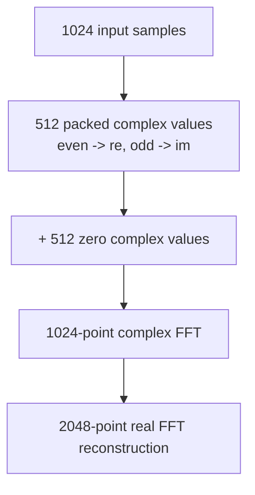
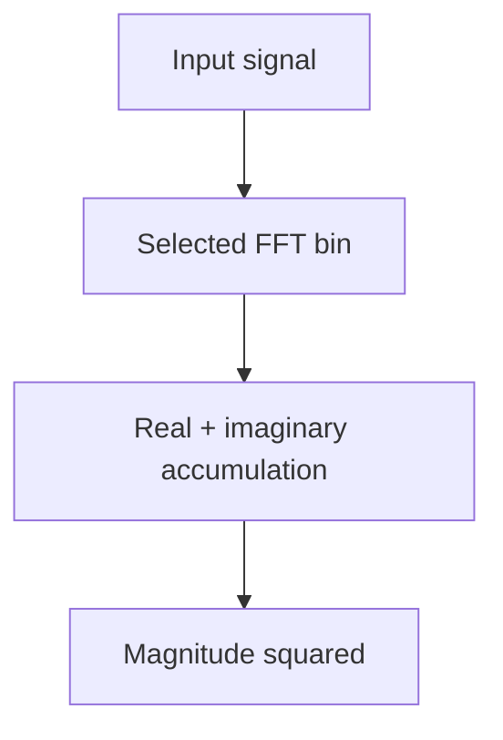

# FFT Processing

Frequency-domain analysis is used for heart-rate estimation and motion analysis.

The processing window contains **1024 samples** acquired at:

```text
Fs = 100 Hz
```

Before the FFT, the signal is prepared by removing its mean, applying a Hann window and zero-padding it to an effective FFT size of 2048 points.

## Signal Preparation

For each 1024-sample processing window:

- the signal mean is calculated and removed,
- a Hann window is applied,
- even and odd samples are packed into the real and imaginary arrays,
- the remaining array positions are filled with zeros.

The input samples are packed as:

```c
re[0] = sample[0];
im[0] = sample[1];

re[1] = sample[2];
im[1] = sample[3];

re[2] = sample[4];
im[2] = sample[5];

// ...
```

Before packing, each sample has its mean removed and is multiplied by the corresponding Hann coefficient.

The 1024 real samples therefore occupy the first 512 complex positions. The remaining 512 positions are filled with zeros.



This is equivalent to zero-padding the original 1024-sample real signal to an FFT length of 2048.

## DC Removal

The mean value of the current processing window is subtracted before the FFT.

This removes the remaining DC component and prevents it from dominating the low-frequency part of the spectrum.

## Hann Window

After DC removal, every sample is multiplied by a Hann window coefficient.

The window reduces spectral leakage caused by processing a finite section of the signal. The Hann coefficients are stored in Q1.31 fixed-point format.

## Real FFT

The custom real FFT implementation uses a 1024-point complex FFT internally to calculate the spectrum of the zero-padded 2048-point real signal.

The packed complex data is first reordered into bit-reversed order. The FFT is then processed in stages, with the block size doubled at each stage:

```text
2 -> 4 -> 8 -> 16 -> ... -> 1024
```

Each stage performs butterfly operations using fixed-point twiddle factors.

## Twiddle Factors

FFT twiddle factors are stored and calculated in Q1.31 format.

Their real and imaginary components are obtained from a precomputed sine lookup table. Multiplication by a twiddle factor therefore uses 64-bit intermediate values followed by a 31-bit shift back to the required scale.

No floating-point trigonometric calculations are performed during signal processing.

## FFT Scaling

Each FFT stage is scaled by 1/2:

```c
output = butterfly_result / 2;
```

This reduces the risk of integer overflow as values are repeatedly combined across FFT stages. The scaling affects the absolute spectrum amplitude but does not change the frequency locations of spectral peaks.

## Real Spectrum Reconstruction

After the complex FFT is complete, the packed even and odd components are combined to reconstruct the spectrum of the original real signal. The DC and Nyquist components are handled separately.

Only the positive-frequency spectrum is required for further processing.

For:

```c
FFT_SIZE = 2048
```

the number of positive-frequency bins including DC and Nyquist is:

```c
SPECTRUM_SIZE = (FFT_SIZE / 2) + 1 = 1025
```

The resulting spectrum therefore contains bins: `0 ... 1024`.

## Frequency Resolution

The frequency represented by FFT bin $k$ is:

$$f_k = \frac{k \cdot F_s}{N}$$

where:
- $k$ is the FFT bin,
- $F_s$ is the sampling frequency,
- $N$ is the FFT size.

For the current configuration:
$F_s$ = 100 Hz
$N$ = 2048

which gives:

$$\Delta f = \frac{100}{2048} \approx 0.0488\text{ Hz}$$

Therefore:

$$f_k \approx k \cdot 0.0488\text{ Hz}$$

The zero padding improves the spacing of the evaluated frequency bins compared with a 1024-point FFT, although it does not add new information to the original signal.

## Single-Bin Calculation

In some parts of the processing pipeline, calculating the complete FFT spectrum is unnecessary.

The function `calculate_single_bin_power()` calculates the power of one selected frequency bin directly:



This is used when the frequency of interest is already known, avoiding calculation of the complete spectrum.

In particular, after heart-rate estimation selects the pulse frequency bin, the RED signal power can be calculated only at that frequency for SpO2 estimation. The single-bin calculation also uses Q1.31 twiddle factors and integer arithmetic.