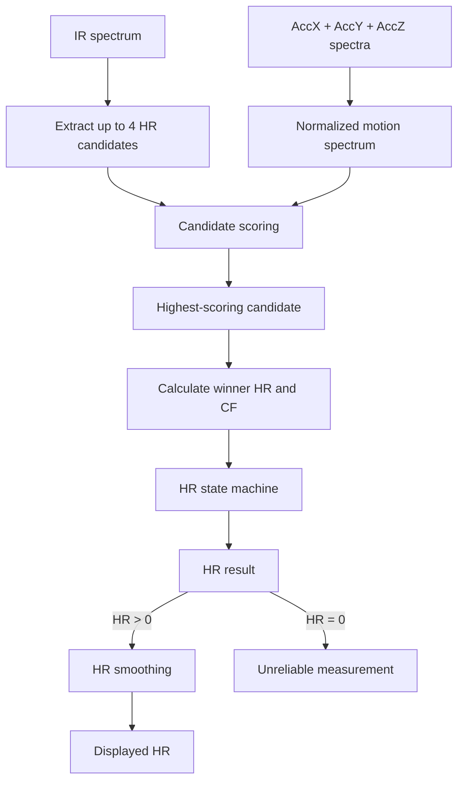

# Heart-Rate Estimation

Heart rate is estimated from the frequency spectrum of the filtered IR PPG signal. Accelerometer spectra are used to reduce the influence of motion-related peaks.

The algorithm consists of four main stages:

1. HR candidate extraction,
2. candidate scoring using PPG and motion information,
3. state-machine validation,
4. output smoothing.

## Heart-Rate Frequency Range

Only the part of the spectrum corresponding to the expected physiological heart-rate range is analyzed.

The firmware uses FFT bins **14 to 68**, corresponding approximately to:

```text
0.67–3.3 Hz
40–200 BPM
```

with:

```text
Fs = 100 Hz
FFT_SIZE = 2048
```

This limits candidate detection and motion analysis to frequencies relevant to heart-rate estimation.

## HR Candidate Extraction

The IR spectrum is searched for local peaks within the HR frequency range. For each bin, spectral power is calculated as:

$$P[k] = \frac{Re[k]^2 + Im[k]^2}{2}$$

A bin is considered a possible HR peak when:

- its power is greater than or equal to both neighboring bins,
- its power is at least twice the mean power of the HR spectrum.

From all detected peaks, up to 4 strongest candidates are retained and ordered by spectral power. For every candidate, the algorithm stores:

- FFT bin index,
- frequency,
- spectral power,
- peak-to-mean power ratio.

Candidate frequency is stored internally in Q14 format and later converted to BPM.

## Power Normalization

Candidate powers are normalized using the minimum and maximum power found within the HR frequency range. The normalized values use a Q31-compatible range:

```text
0 ... 2147483647
```

The combined accelerometer spectrum is normalized in the same way. This places PPG candidate power and motion power on a comparable numerical scale before candidate scoring.

## Peak-to-Mean Power Ratio

For every HR candidate, the algorithm calculates a peak-to-mean spectral power ratio:

$$CF = \frac{P_{peak}}{P_{mean}}$$

The ratio is stored in Q12 format. The current threshold is:

```c
TH_CF_Q12 = 29491
```

which corresponds approximately to:

$$\frac{29491}{4096} \approx 7.2$$

It is used later by the HR state machine to determine whether the winning spectral peak is sufficiently well defined.

## Motion Spectrum

Motion power is calculated from the AccX, AccY and AccZ spectra over the same FFT bins used for heart-rate estimation. For every frequency bin:

$$P_{motion}[k] = P_x[k] + P_y[k] + P_z[k]$$

The resulting motion spectrum is normalized before it is used during candidate scoring.

For each HR candidate, the algorithm searches for the strongest motion component within ±2 FFT bins around the candidate frequency. Using nearby bins rather than only the exact candidate bin accounts for small differences between the PPG and accelerometer spectral peak positions.

## Candidate Scoring

Every valid HR candidate receives a score:

$$Score = P_{PPG} - P_{motion} + B_{history}$$

More precisely:

```text
score =
    normalized PPG candidate power
    - weighted nearby motion power
    + history bonus
```

### Motion Penalty

The strongest motion power within ±2 bins of the candidate is multiplied by:

```c
MAIN_PENALTY_Q12 = 4506
```

which corresponds approximately to:

$$\frac{4506}{4096} \approx 1.10$$

A candidate located close to a strong accelerometer component therefore receives a lower score.

### History Bonus

Candidates close to the last stable heart-rate estimate receive an additional bonus. The bonus is applied only when:

```text
|candidate HR - last stable HR| < 15 BPM
```

and increases as the candidate gets closer to the previous stable value. The current bonus weight is:

```c
BONUS_Q12 = 61
```

which corresponds approximately to:

$$\frac{61}{4096} \approx 0.015$$

The history bonus increases the score of candidates that are close to the last stable heart-rate estimate.

## Winner Selection

After all candidates have been scored, the candidate with the highest score becomes the current HR winner. Its frequency is converted to BPM:

$$HR = f_{winner} \cdot 60$$

The selected FFT bin and original IR AC power are also retained for later SpO2 estimation. The winning candidate is not immediately accepted as the final HR result. It is first evaluated by the HR state machine.

## HR State Machine

The state machine prevents isolated spectral disturbances or sudden candidate changes from immediately affecting the reported heart rate. It uses four states:

- `STABLE`
- `ALERT`
- `UNCERTAIN`
- `RECOVERY`

The main validation conditions are:

- peak-to-mean power ratio (`TH_CF_Q12`),
- difference from the last stable HR,
- consistency of consecutive HR candidates.

The maximum allowed HR difference used by the state machine is:

```c
MAX_HR_DIFF = 6 BPM
```

### STABLE

`STABLE` represents normal tracking with a reliable HR estimate. A new winner is accepted when:

- its CF exceeds `TH_CF_Q12`,
- its difference from the last stable HR is no greater than `MAX_HR_DIFF`.

The first valid HR estimate can be accepted without the HR-difference check. If these conditions are not met, the previous stable HR is retained and the state changes to `ALERT`.

### ALERT

`ALERT` indicates that the newest estimate may no longer be reliable.

If a sharp spectral peak appears again, the state moves to `RECOVERY`. If the signal remains weak for 3 consecutive windows, the state moves to `UNCERTAIN`. Until then, the previous stable HR is retained.

### UNCERTAIN

`UNCERTAIN` represents a period where the algorithm no longer considers the current HR reliable. The output is set to 0.

Two consecutive windows with a sufficiently sharp spectral peak are required before the algorithm can leave this state and begin recovering the HR estimate.

### RECOVERY

`RECOVERY` verifies that the new HR values are stable before allowing them to replace the previous stable result.

Sharp candidates are observed over consecutive windows. After 3 recovery windows, the two most recent HR changes must both be within `MAX_HR_DIFF = 6 BPM`.

If they are consistent, the new HR becomes stable and the state returns to `STABLE`. If signal quality drops again, the algorithm returns to `ALERT`.

### State Flow

```mermaid
flowchart TD
    START(( )) --> STABLE

    STABLE -->|CF > threshold and HR change ≤ 6 BPM| STABLE
    STABLE -->|CF ≤ threshold or HR change > 6 BPM| ALERT

    ALERT -->|CF > threshold| RECOVERY
    ALERT -->|CF ≤ threshold for 3 windows| UNCERTAIN
    ALERT -->|CF ≤ threshold, fewer than 3 windows| ALERT

    UNCERTAIN -->|CF > threshold for 2 windows| ALERT
    UNCERTAIN -->|CF ≤ threshold| UNCERTAIN

    RECOVERY -->|CF > threshold and 3 consistent HR windows| STABLE
    RECOVERY -->|CF > threshold but HR not yet consistent| RECOVERY
    RECOVERY -->|CF ≤ threshold| ALERT

    UNCERTAIN ~~~ RECOVERY

    style START fill:#333,stroke:#333,stroke-width:2px

```



## HR Smoothing

After state-machine validation, the reported HR is additionally smoothed using an exponential filter:

$$HR_{display} = HR_{display} + \alpha(HR - HR_{display})$$

The smoothing coefficient is stored in Q8:

```c
HR_SMOOTH_ALPHA = 71
```

therefore:

$$\alpha = \frac{71}{256} \approx 0.277$$

The first valid HR value initializes the displayed result directly. Later estimates gradually update it using the smoothing coefficient. Invalid HR values (HR <= 0) are returned as 0 and do not update the stored smoothed HR value.

## Processing Flow

