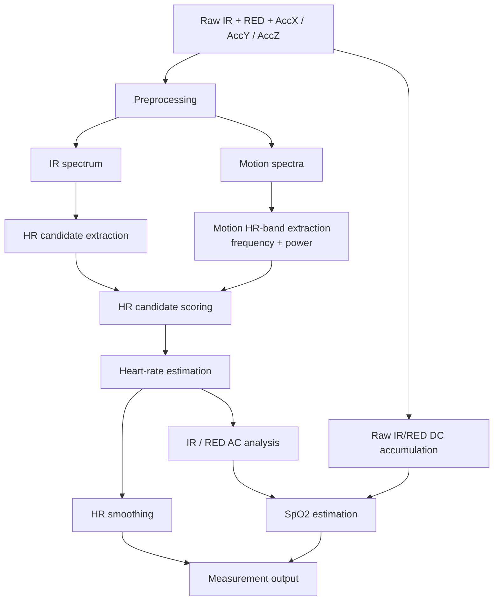

# Signal Processing Overview

The signal-processing pipeline estimates heart rate and SpO2 from the MAX30102 PPG signals while using accelerometer data to reduce the influence of motion artifacts.

The main processing window contains **1024 samples** of filtered IR, RED, AccX, AccY and AccZ data.

Signal processing is divided into several stages:

1. signal preprocessing,
2. frequency-domain analysis,
3. motion spectrum analysis,
4. heart-rate candidate selection and scoring,
5. heart-rate stabilization,
6. SpO2 estimation.

## Preprocessing

IR, RED and accelerometer channels are processed using the same preprocessing chain:

- 3-sample median filtering,
- Butterworth band-pass filtering at approximately **0.4–4 Hz**.

The median filter suppresses short impulse spikes, while the band-pass filter isolates the frequency range relevant to pulse and motion analysis.

Raw IR and RED values are additionally retained for SpO2 DC estimation.

## Frequency Analysis

Heart-rate estimation is performed in the frequency domain.

The filtered IR signal is:

1. centered by removing its DC offset,
2. multiplied by a Hann window,
3. transformed using a custom fixed-point real FFT.

The FFT is calculated from a **1024-sample processing window**, and the resulting IR spectrum is searched for possible heart-rate peaks.

## Motion Analysis

The filtered AccX, AccY and AccZ signals are also transformed into the frequency domain.

Their spectra are combined to estimate motion energy within the heart-rate frequency range.

This information is used during HR candidate scoring to reduce the probability of selecting a spectral peak caused by movement.

## Heart-Rate Estimation

Several of the strongest IR spectrum peaks are treated as possible heart-rate candidates.

Each candidate is scored using:

- PPG spectral power,
- motion-related penalty,
- continuity with previous HR estimates.

The highest-scoring candidate is converted from frequency to BPM.

A state machine then evaluates the candidate using additional stability and signal-quality conditions before it is accepted as the heart-rate result. Output smoothing is applied afterwards to reduce sudden changes in the reported value.

## SpO2 Estimation

SpO2 calculation is performed after heart-rate estimation.

The HR algorithm determines the frequency bin corresponding to the selected pulse component. The AC power of the IR and RED signals is evaluated at this frequency.

SpO2 estimation combines:

- IR AC power,
- RED AC power,
- raw IR DC level,
- raw RED DC level.

These values are used to calculate the RED-to-IR ratio required for oxygen saturation estimation.

## Processing Flow

All signal-processing algorithms are implemented using integer and fixed-point arithmetic.