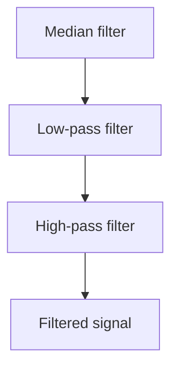

# Signal Preprocessing

All measurement channels are preprocessed before they are added to the processing window used for HR and SpO2 estimation.

The same preprocessing chain is applied to:

- IR
- RED
- AccX
- AccY
- AccZ

The preprocessing pipeline consists of:

1. a 3-sample median filter,
2. a Butterworth low-pass filter,
3. a Butterworth high-pass filter.

The cascaded low-pass and high-pass sections form a band-pass filter with an effective passband of approximately **0.4–4 Hz**.

## 3-Sample Median Filter

The first preprocessing stage is a three-sample median filter.

For every new input sample, the filter compares:

- the current sample,
- the previous sample,
- the sample before it.

The middle value of the three is returned.

This suppresses short impulse spikes without averaging neighboring samples in the same way as a moving-average filter.

A single large disturbance can therefore be rejected while preserving the local signal shape.

## Butterworth Band-Pass Filter

After median filtering, the signal is processed by two cascaded biquad sections:



Together, the two Butterworth sections provide an effective passband of approximately **0.4 Hz – 4 Hz**.

The high-pass section removes slow baseline changes and constant offsets, while the low-pass section suppresses higher-frequency components outside the useful PPG and motion range.

Each biquad implements the difference equation:

$$y[n] = b_0 x[n] + b_1 x[n-1] + b_2 x[n-2] - a_1 y[n-1] - a_2 y[n-2]$$

## Fixed-Point Implementation

The filter coefficients are stored in Q2.30 fixed-point format.

This provides 30 fractional bits while still allowing coefficient values greater than 1 in magnitude. The filter state and input/output samples are stored as integers. Intermediate multiplication and accumulation use 64-bit integers to avoid overflow during the biquad calculation.

After accumulation, the result is shifted right by 30 bits to return it to the original signal scale:

```c
int32_t output = (accum + (1LL << 29)) >> 30;
```

The additional value before the shift provides rounding instead of simple truncation.

## Filter State Initialization

A biquad filter stores previous input and output samples as part of its internal state.

If the filter state were initialized to zero, the first valid PPG or accelerometer sample could produce a large startup transient. To avoid this, the filter is initialized from the first valid sample.

For the low-pass section, the initial output is calculated from the filter's steady-state DC response:

$$y_{init} = x \cdot \frac{b_0 + b_1 + b_2}{1 + a_1 + a_2}$$

The previous low-pass input and output values are then initialized to this steady-state value.

The high-pass section receives the initialized low-pass output as its previous input, while its previous outputs are initialized to zero. This makes the filter start close to the expected steady-state condition instead of artificially transitioning from zero.