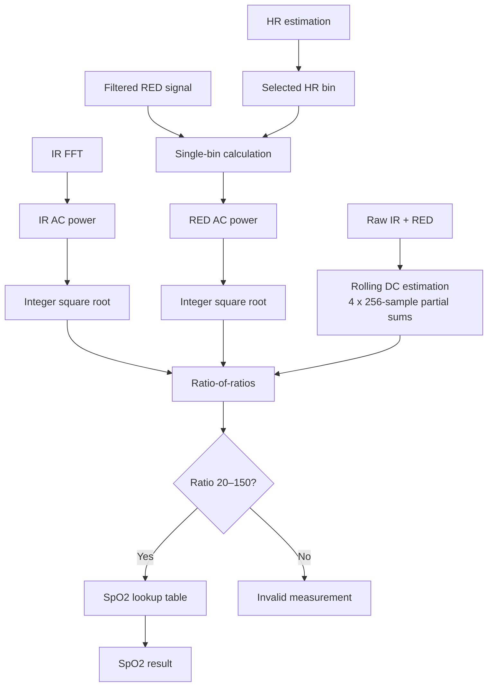

# SpO2 Estimation

SpO2 is estimated using the RED and IR PPG signals from the MAX30102.

The calculation uses the ratio between the AC and DC components of both optical channels. Heart-rate estimation is performed first because the selected HR frequency bin is reused for the SpO2 AC calculation.

## AC and DC Components

The SpO2 algorithm uses:

- IR AC amplitude,
- RED AC amplitude,
- raw IR DC level,
- raw RED DC level.

The AC components represent the pulsating part of the PPG signal, while the DC components represent the average optical level.

The general ratio-of-ratios relationship is:

$$R = \frac{AC_{RED}/DC_{RED}}{AC_{IR}/DC_{IR}}$$

The firmware scales this ratio by 100 before using it as an index in the SpO2 lookup table.

## Rolling DC Estimation

The IR and RED DC levels are calculated directly from the **raw, unfiltered PPG samples**.

The 1024-sample DC window is divided into four partial sums of 256 samples:

```text
1024-sample DC window

+------------+------------+------------+------------+
| 256 samples| 256 samples| 256 samples| 256 samples|
|   sum[0]   |   sum[1]   |   sum[2]   |   sum[3]   |
+------------+------------+------------+------------+
```

When all four parts are available, the DC values are calculated as:

$$DC_{IR} = \frac{\sum IR}{1024}$$

$$DC_{RED} = \frac{\sum RED}{1024}$$

Afterwards, the partial sums are shifted:

```text
sum[1] -> sum[0]
sum[2] -> sum[1]
sum[3] -> sum[2]
new data -> sum[3]
```

This allows the DC estimate to be updated every 256 new samples without summing the complete 1024-sample window again.

## HR Frequency Bin

SpO2 estimation uses the frequency bin selected by the heart-rate algorithm.

When the winning HR candidate is selected, the firmware stores:

- its FFT bin,
- the original IR spectral power at that bin.

The IR AC power is therefore already available from the full IR FFT used for heart-rate estimation.

## RED Single-Bin Calculation

A complete RED FFT is not required because the pulse frequency is already known from the HR calculation.

Instead, the RED signal is processed only at the selected HR bin using `calculate_single_bin_power()`.

Before the calculation:

- the RED signal mean is removed,
- a Hann window is applied,
- the real and imaginary components of the selected frequency bin are accumulated.

This produces the RED AC power without calculating the complete RED spectrum.

## AC Amplitude

The FFT calculations provide spectral power:

$$P = Re^2 + Im^2$$

The ratio-of-ratios calculation requires AC amplitude rather than power.

The firmware therefore calculates the integer square root:

```c
AcIr  = isqrt(power_acIr);
AcRed = isqrt(power_acRed);
```

which gives values proportional to:

$$AC = \sqrt{P}$$

`isqrt()` performs the square-root calculation using integer arithmetic, so no floating-point operations are required.

## Ratio Calculation

The firmware calculates:

```text
ratio = 100 × AcRed × dcIr
              ----------------
               AcIr × dcRed
```

which is equivalent to:

$$ratio = 100 \cdot \frac{AC_{RED}/DC_{RED}}{AC_{IR}/DC_{IR}}$$

The factor of 100 allows the ratio to be represented as an integer.

## SpO2 Lookup Table

The calculated ratio is used as an index in a predefined lookup table:

```c
spo2 = spo2_table[ratio];
```

The lookup table converts the RED-to-IR ratio into the estimated oxygen saturation value. This avoids evaluating a floating-point calibration equation at runtime.

## Result Validation

The SpO2 result is rejected when the ratio cannot be calculated or falls outside the supported lookup range.

The firmware returns 0 when:

- the ratio denominator is zero,
- the calculated ratio is below 20,
- the calculated ratio is above 150.

Only ratios within:

```text
20 <= ratio <= 150
```

are passed to the lookup table.

## Processing Flow



All SpO2 calculations use integer and fixed-point arithmetic. No floating-point arithmetic is used in the firmware implementation.