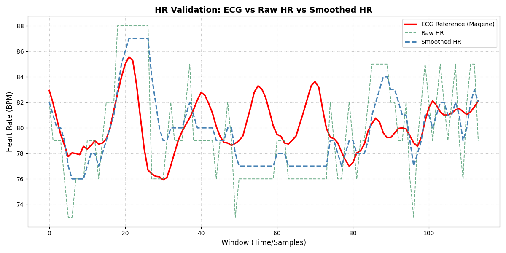
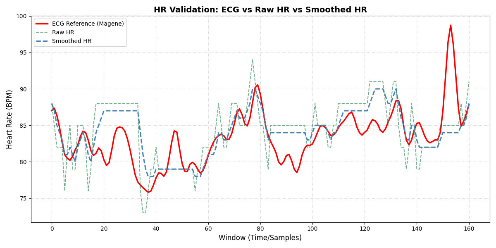
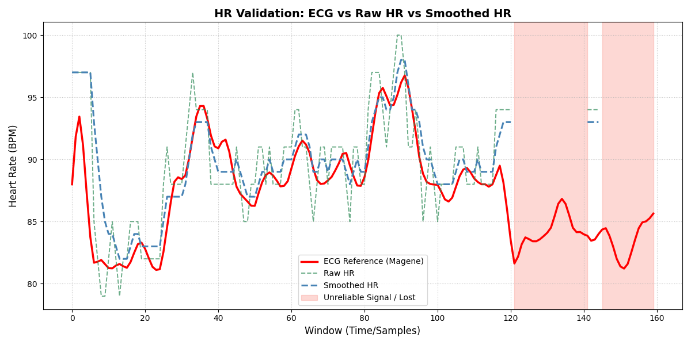
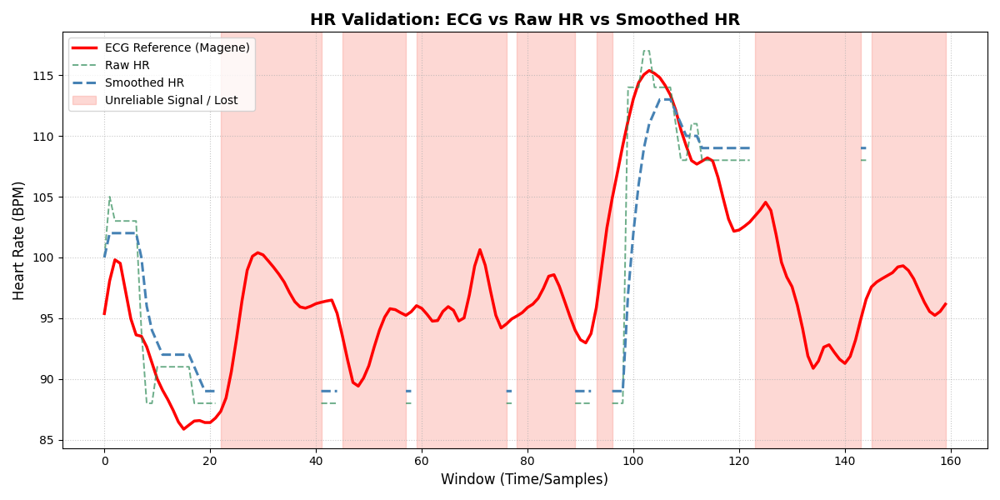
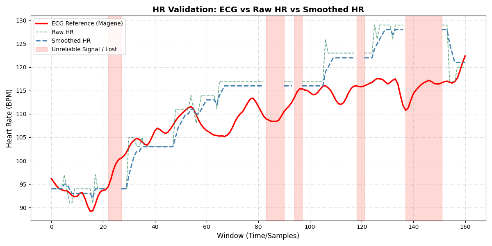
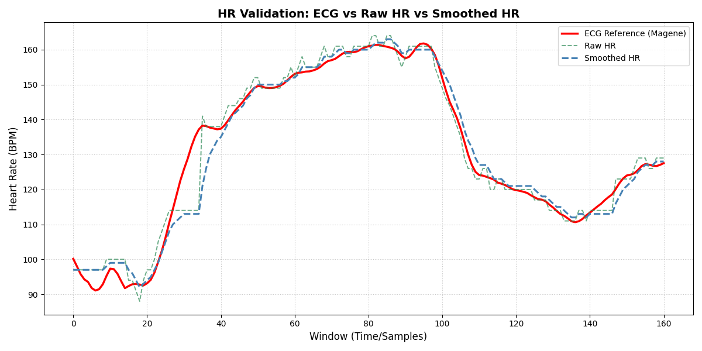
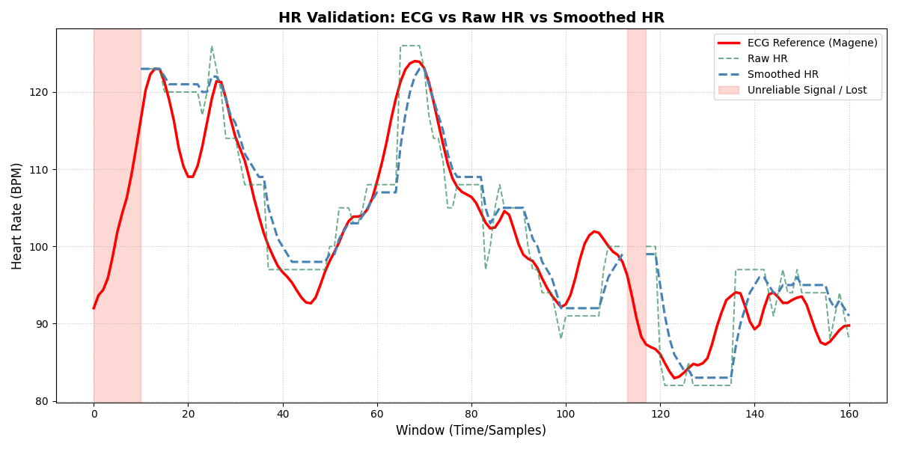
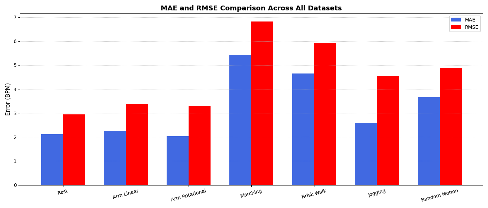
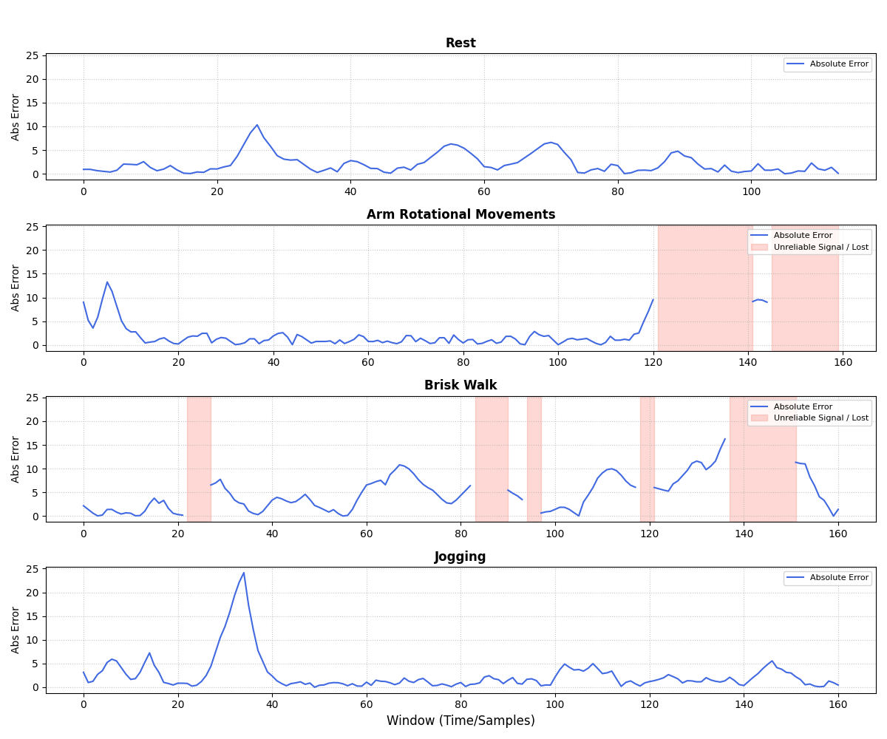
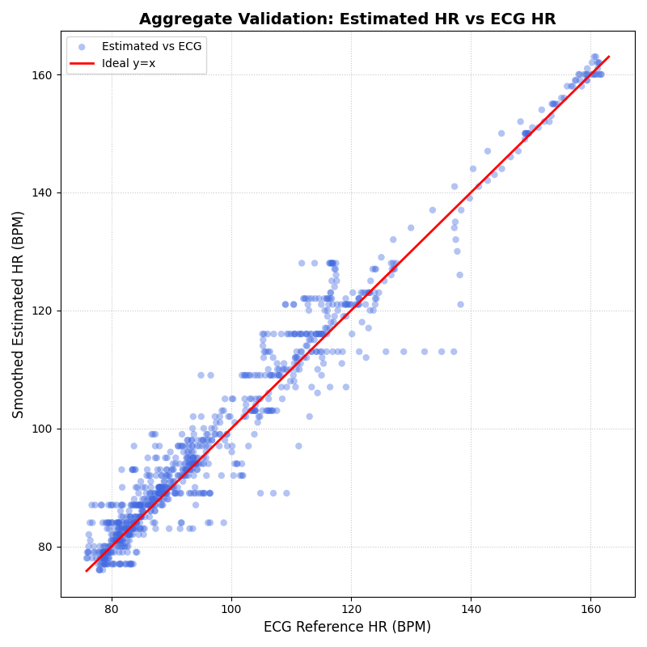

# Heart-Rate Validation

Heart-rate estimation was evaluated using seven recordings covering resting conditions, controlled motion and whole-body activity.

ECG chest strap was used as the reference heart-rate source.

Both the raw HR result produced by the state machine and the final smoothed HR output were evaluated.

## Evaluation Metrics

For every dataset, the following metrics are calculated:

| Metric | Description |
| :--- | :--- |
| Valid ratio | Percentage of reference windows where the algorithm returned a valid HR |
| MAE | Mean absolute error relative to ECG |
| RMSE | Root mean square error relative to ECG |
| Bias | Mean signed error |
| Max error | Largest absolute HR error |
| Within ±5 BPM | Percentage of valid estimates within 5 BPM of ECG |
| Within ±10% or 5 BPM | Percentage of valid estimates within the larger tolerance of ±10% of ECG HR or ±5 BPM |

The main acceptance criteria are:

| Metric | Requirement |
| :--- | :--- |
| MAE | ≤ 5 BPM |
| RMSE | ≤ 7 BPM |
| Within ±5 BPM | ≥ 50% |
| Within ±10% or 5 BPM | ≥ 80% |

## Overall Results

| Dataset | Valid ratio [%] | MAE [BPM] | RMSE [BPM] | Bias [BPM] | Max error [BPM] | Within ±5 BPM [%] | Within ±10% or 5 BPM [%] |
| :--- | ---: | ---: | ---: | ---: | ---: | ---: | ---: |
| Rest | 100.00 | 2.12 | 2.94 | -0.31 | 10.30 | 88.60 | 98.25 |
| Linear arm motion | 100.00 | 2.27 | 3.38 | 0.74 | 14.73 | 88.20 | 96.89 |
| Rotational motion | 78.12 | 2.03 | 3.30 | 1.62 | 13.26 | 88.80 | 92.00 |
| Marching in place | 39.38 | 5.43 | 6.82 | -0.14 | 20.22 | 53.97 | 90.48 |
| Brisk walk | 80.12 | 4.65 | 5.91 | 3.23 | 16.25 | 58.14 | 96.90 |
| Jogging | 100.00 | 2.60 | 4.55 | -0.29 | 24.15 | 89.44 | 96.27 |
| Random motion | 91.30 | 3.67 | 4.88 | 1.20 | 12.30 | 73.47 | 93.88 |

## HR Tracking Across Datasets

The following plots compare the ECG reference HR with the raw HR produced by the state machine and the final smoothed HR output.

Red shaded regions indicate periods where the algorithm did not provide a reliable HR result.

### Rest

During rest, both raw and smoothed HR remain close to the ECG reference for most of the recording. The raw estimate shows small short-term variations, while smoothing reduces these fluctuations and follows the general HR trend more steadily.

No prolonged loss of the HR estimate is observed.

### Linear Arm Movements

During linear arm and finger movements, the algorithm continues to follow the ECG reference through most of the recording.

Short differences appear during faster HR changes and isolated disturbances, but the estimate generally returns to the reference trend. The smoothed output reduces short fluctuations produced by the raw HR estimate.

### Rotational Arm Movements

The HR estimate remains close to the ECG reference during most rotational arm and wrist movements.

Periods of unreliable signal appear near the end of the recording, where the state machine rejects the measurement instead of continuing to report an unstable HR value.

Outside these rejected periods, both raw and smoothed HR follow the reference closely.

### Marching in Place

Marching and light jogging in place introduce significantly stronger motion artifacts.

The algorithm identifies several periods where the HR estimate is considered unreliable and temporarily suppresses the result.

When a valid estimate is available, the HR generally follows the ECG trend, although this recording produces noticeably more interruptions than the controlled arm-motion datasets.

### Brisk Walk

Brisk walking produces both short and prolonged periods of unreliable PPG signal.

The algorithm follows the reference well during several parts of the recording, but larger deviations appear during stronger motion, particularly in the later section.

This dataset represents one of the more difficult conditions for the HR estimator.

### Jogging

Despite continuous whole-body motion, the HR estimate follows the large changes in the ECG reference well through most of the jogging recording.

The smoothed HR introduces a small delay during rapid increases and decreases in heart rate, as expected from the output smoothing stage.

After these transitions, the estimate converges closely to the ECG reference.

### Random Motion

The random-motion recording combines several different types of movement and therefore produces less predictable signal disturbances.

The algorithm tracks the ECG reference through most valid sections while rejecting several periods affected by stronger motion artifacts.

Some larger differences are visible during rapidly changing or highly irregular movement, but the estimator recovers after the disturbed sections.

## Error Comparison Across Datasets

The MAE and RMSE comparison shows how HR estimation performance changes with the type of motion.

The lowest errors are observed during rest and controlled arm movements. More complex whole-body movement generally increases the estimation error, with marching in place and brisk walking producing the largest errors among the tested datasets.

Jogging produces several larger individual errors but maintains relatively good average accuracy over the complete recording.

## Absolute HR Error Over Time

To examine where the estimation errors occur, four representative datasets were selected:

- rest,
- rotational arm movement,
- brisk walking,
- jogging.

During rest, the absolute HR error remains low for most of the recording, with only several short increases.

Rotational arm movements also produce mostly small errors while the signal remains valid. Larger disturbances appear close to periods where the state machine subsequently rejects the measurement.

Brisk walking produces more frequent and sustained increases in HR error, showing the stronger influence of continuous motion on the PPG signal.

Jogging contains one pronounced error period during a rapid HR transition, while the remaining part of the recording shows relatively small errors despite continuous movement.

The shaded regions correspond to periods where no reliable HR result was produced and therefore no HR error is calculated.

## Aggregate ECG Agreement

The aggregate scatter plot combines valid smoothed HR estimates from all seven datasets.

The red line represents ideal agreement between the estimated HR and the ECG reference:

$$
HR_{estimated} = HR_{ECG}
$$

Most measurements are concentrated close to the ideal line, showing that the algorithm follows the reference HR over a wide range of heart rates and motion conditions.

Larger deviations occur mainly in the middle HR range, where several motion-heavy recordings introduce stronger PPG artifacts. The horizontal groups of points are partly caused by the discrete FFT-based HR estimation and the state-machine behavior, which can temporarily retain a previous stable result.

Overall, the plot shows a strong relationship between the estimated HR and the ECG reference across the combined validation dataset.