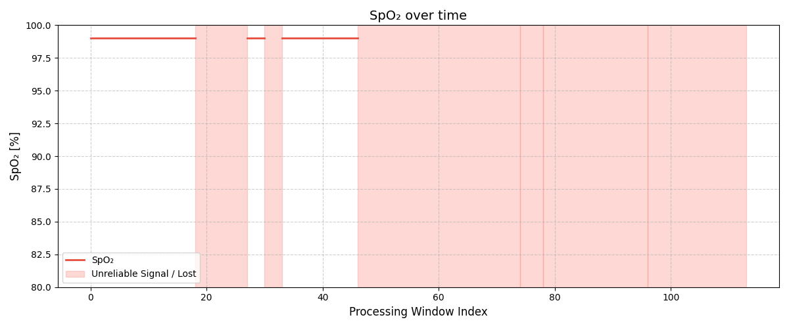
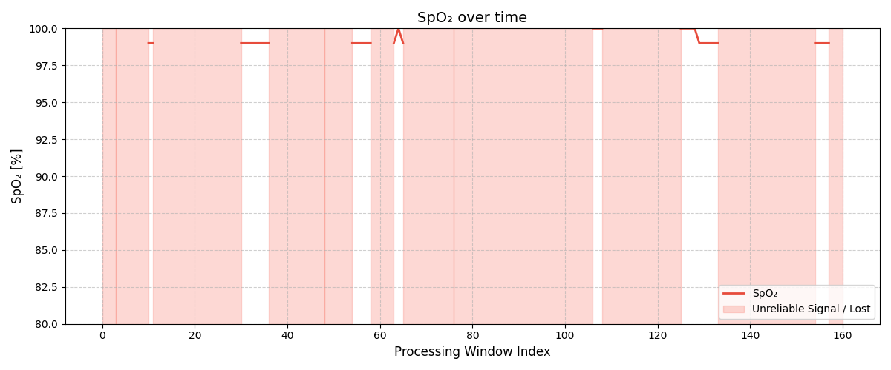

# SpO2 Validation

SpO2 estimation was evaluated using the same seven recordings used for heart-rate validation.

No independent reference SpO2 measurement was recorded. Therefore, the results cannot be used to evaluate absolute SpO2 accuracy.

The firmware reports SpO2 only when a valid heart-rate result is available and the HR state machine is in the `STABLE` state. During `ALERT`, `UNCERTAIN` or `RECOVERY`, the SpO2 result is suppressed.

Across all valid measurement windows, the estimated SpO2 remained within approximately **99–100%**.

Because the valid SpO2 values showed very little variation, the main useful validation metric is result availability rather than numerical variation.

## SpO2 Availability

| Dataset | Valid SpO2 ratio [%] |
| :--- | ---: |
| Rest | 35.09 |
| Linear arm motion | 46.58 |
| Rotational motion | 10.00 |
| Marching in place | 6.88 |
| Brisk walk | 22.36 |
| Jogging | 41.61 |
| Random motion | 45.34 |

The valid SpO2 ratio is relatively low due to the strict reporting conditions. Consequently, activities involving more intense movement, such as brisk walking, result in a significant drop in result availability.

## Example Results

### Rest

During rest, the SpO2 estimate remains stable at approximately 99% for all valid measurement windows.

### Brisk Walk

Brisk walking produces considerably more periods where the signal is considered unreliable. SpO2 is therefore suppressed during these intervals.

When the signal is accepted, the estimated SpO2 remains within approximately 99–100%.

## Limitations

The recorded datasets are useful for evaluating SpO2 output stability and availability under motion, but they do not provide a reference oxygen-saturation measurement.

Validation of absolute SpO2 accuracy requires simultaneous measurements with a reference pulse oximeter, preferably covering a wider range of oxygen saturation values.